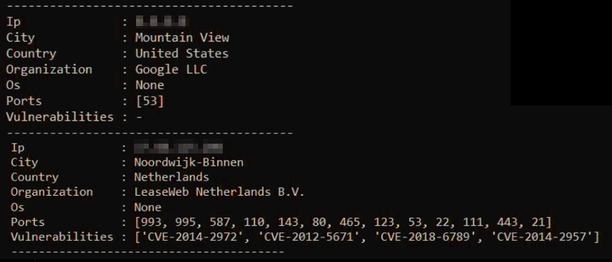
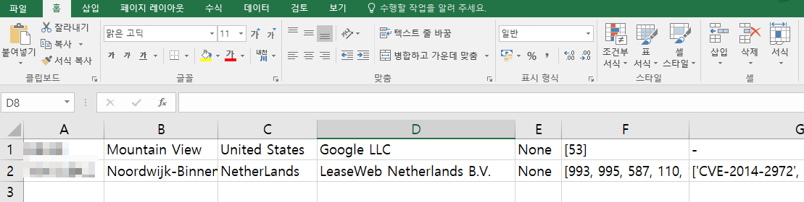

# 📡 Shodan Search IP

## 💁‍♂️ Introducing Project

> -   Open Source Intelligence(OSINT) 프로그램 shodan api 이용
> -   취약점 정보수집 자동회 점검 도구
> -   Excel에 있는 IP 리스트의 Shodan이 수집한 정보를 엑셀로 정리
> -   IP, host, OS, 지역, 위치, 개방된 port, 취약점 번호(CVE) 수집
> -   수집한 정보를 엑셀로 자동으로 결과 저장

## 📅 Date / Developer

> -   2020.01.03 ~ 2020. 01.15 (2주)
> -   1인 프로젝트

## 📌 Point

> -   취약점 정보수집 자동회 점검 도구
> -   Shodan api
> -   엑셀 자동 읽기/쓰기

## 🛠 Using Skill

> -   Pyhon

## 🌐 News API

> -   [shodan API](https://www.shodan.io/)

## 🔔 Alarm

> -   본 프로젝트는 유료 apikey를 사용하였습니다.
> -   api를 사용하기 위해서는 shodan 멤버십이 필요합니다.

## 🔧 How To Use?

#### install

```
pip install shodan
pip install openpyxl
```

#### practice

```
1. IP_LIST.xlsx의 첫번째 열에 점검 대상 IP 입력
2. ShodanSearch.py 파일 실행
3. shodan 정보수집 진행
4. 실행종료
5. IP_LIST.xlsx파일 확인
```

<br/>
<br/>

## 👓 Screen

<p>콘솔에서 정보수집 확인</p>
<center>
  
</center>

<p>해당 정보를 엑셀로 정리</p>
<center>
  
</center>
